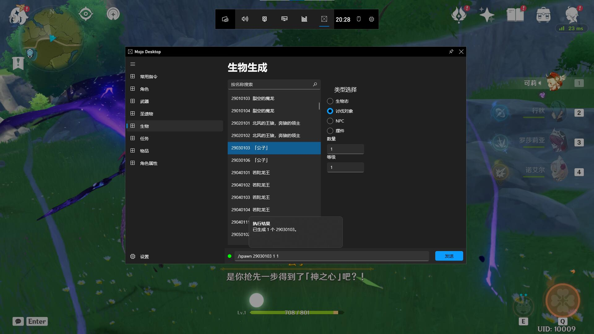

# Mojo-Desktop

-----

> 让你在 Xbox Game Bar 里快捷执行gc的命令/指令生成器。

[EN](./README-en.md) | 中文

## 使用截图

## 使用方法
**请注意：远程执行需要服务端安装 [[mojoconsole plus]](https://github.com/gc-mojoconsole/gc-mojoconsole-backend) 插件！**
1. 到  里下载安装包
2. 解压到任意文件夹，进行安装，具体步骤如下：
   + 双击 Mojo Desktop_[版本]_x64.cer 安装签名（必须）
   + 双击 Mojo Desktop_[版本]_x64.msixbundle 安装应用程序
3. 打开并且进入游戏（gc）
4. 按住 Win+G 打开 XboxGamebar
5. 在插件列表里找到MojoDesktop插件并打开
6. 愉快地玩耍

**签名安装步骤：安装证书->本地计算机->将所有的证书都放入下列存储（浏览）->受信任的根证书颁发机构->确定**

## Bug反馈：

请到 [Issues](https://github.com/gc-toolkit/Mojo-Desktop/issues) 里反馈。

